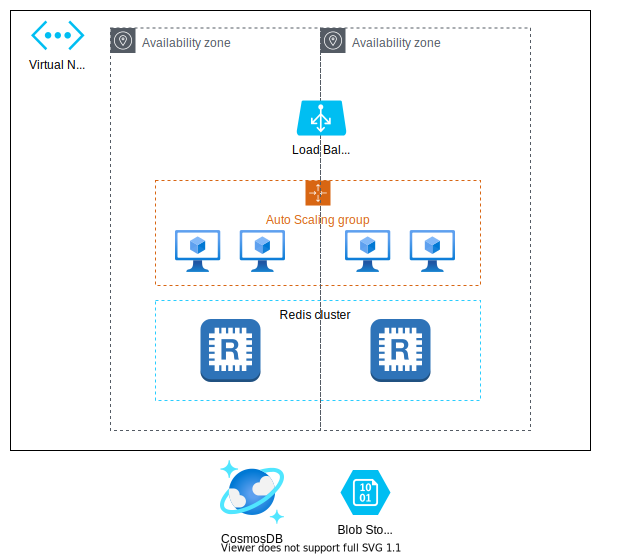

# Развертывание приложения в отказоустойчивой масштабируемой инфраструктуре
## Введение
### О проекте
Целью текущего проекта является развертывание приложения в отказоустойчивой масштабируемой инфраструктуре на платформе Azure. В вашем распоряжении имеется ограниченный набор сервисов, который включается в себя:
* Virtual Machines
* Container Instances
* Cosmos DB
* Cache for Redis
* Blob storage
* Virtual Network
* Load Balancer

Вышеуказанный перечень сервисов является достаточным для выполнения задания, однако нет необходимости использовать все сервисы одновременно.

Все необходимые роли преднастроены, конфигурация RBAC не требуется.

### Описание приложения
Приложение представляется из себя небольшой веб-сервер. При необходимости переменные можете задать в файле env.yml, такие как имя таблицы, путь до кластера Redis. Для проверки работоспособности приложения можете использовать страницу /status.

Для оценки здоровья сервера другими сервисами можете использовать страницу /health.

### Базовое состояние
Вам предоставлена учетная запись для доступа в Azure Portal. Так же вам предоставлен доступ к Request Dashboard, в котором вам будет необходимо указать точку входа в развернутое приложение в формате `http://[IP-адрес]:[порт]` или `http://[FQDN]:[порт]`. Вам необходимо будет залогиниться через Azure.

Задание и учетные данные для Azure Portal расположены в дашборде.

## Техническое задание
### Virtual Network
Инфраструктура должна быть расположена в отдельном Virtual Network. Определите адресацию и размер подсетей по своему усмотрению. Ограничьтесь двумя зонами доступности.

### Blob Storage
Дистрибутив приложения может быть расположен в отдельном Blob Storage.

### Load balancer
* Для пользователей из сети интернет сервис должен быть доступен по протоколу HTTP на порту 80.
* Внутри инфраструктуры load balancer должен быть направлен на порт 8080.

Используйте страницу `/health` для проверки состояния веб-сервера.

### Auto Scaling
Группа должна иметь следующие параметры:

* Min instances: 1
* Max: 4
* Desired: 1
* Scaling Policy: Requests per instance
* Scale out: >= 20
* Scale in: < 20
* Warm: 120 sec
* Cooldown: 120 sec

Убедитесь, что приложение запускается корректно

### Cosmos DB
Создайте базу данных CosmosDB. После этого создайте контейнер. Контейнер должна содержать только Partition Key (без Unique Key).

Укажите имя вашей базы данных и ссылку на неё, имя контейнера, Partition Key и ключа в конфигурационном файле приложения (env.yml).

### Redis
Кластер должен быть развернут со следующими параметрами:

* Размер кластера: 2 узла
* Размер инстанса: C0
* Должна охватывать обе зоны доступности

Укажите адрес и порт развернутого кластера в конфигурационном файле приложения (env.yml).

## Архитектура
На диаграмме представлена референсная архитектура создаваемой вами инфраструктуры. Ваше решение может отличаться, однако оно должно отвечать следующим требованиям:
* приложение должно быть отказоустойчивым на уровне региона (West US 2);
* инфраструктура должна автоматически масштабироваться в зависимости от количества запросов на каждый инстанс/контейнер;
* предпочитаемый размер инстанса приложения / кластера контейнеров должен быть **B1s**.

